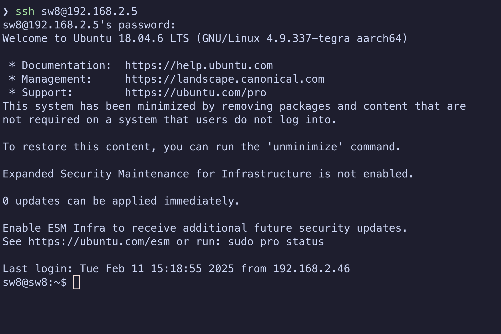
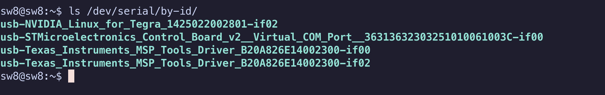
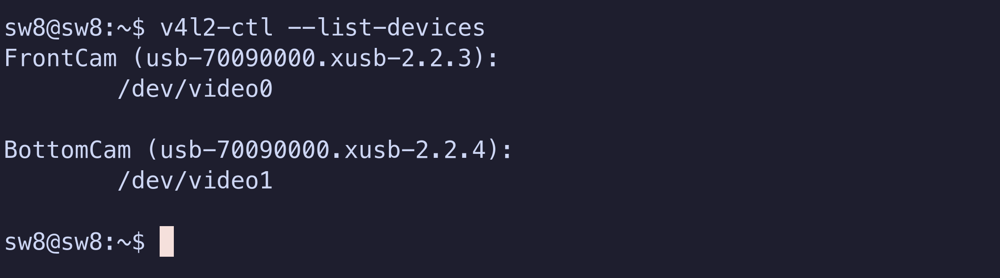

# SeaWolf 8 Dryrun Procedures
> [!WARNING] 
> Unless you know what you are doing, please use the team laptop instead of your personal device
>
> It is known to work and most troubleshooting instructions assume that you are using

## Connect to the system
1. Connect BOTH batteries to the robot (**this is important!** LBB is known to misbehave a little if the robot is powered on with only one battery present!)
2. Power the robot on using the system switch
3. Connect the tether to the end cap and the other end to your computer
4. Wait up to 2 minutes for your computer to connect to the Jetson by ethernet. Once connected, continue. Otherwise, see [Jetson Troubleshooting](./jetson-troubleshooting.md#checking-connection)
5. SSH into the Jetson by running the following command in a terminal (works on windows too): `ssh sw8@192.168.2.5`
	 1. If prompted about a "fingerprint" enter "yes"
	 2. Enter the password when prompted (ask other members if you don't know the password)
	 3. Once you've entered the password, you'll have a ssh session connected to the Jetson. You'll see a shell from the Jetson in your terminal now.


## Verify everything is connected to the Jetson
> [!IMPORTANT]
> Run the following commands on the Jetson over the ssh connection.

First make sure all necessary UART devices are present:
```bash
ls /dev/serial/by-id/
```

You should see several devices. Make sure the following exist:
- **1** Control board
- **2** "TI MSP430" devices (MEB, it's actually just one device but shows up as two)
- **2** "Digilent" devices (Acoustics FPGA, it's actually just one device, but shows up as two).

Example output:

> [!NOTE]
> The output will vary slightly:
> - These names include serial numbers
> - The control board may be either Adafruit or STMicroElectronics
> - Acoustics may not be installed

Then, make sure cameras are connected:
```bash
v4l2-ctl --list-devices
```

You should see two devices labeled `FrontCam` and `BottomCam` (two different sections as shown below!):

## Test Arm & Kill
1. Arm the robot using the hardware switch
2. The thrusters should beep 5 times
	 1. 3 short ascending beeps
	 2. 1 long low beep
	 3. 1 long high beep
3. Wait 3 seconds
4. Disarm the robot
5. Wait 3 seconds
4. Rearm the robot
5. The thrusters should beep again
	
## Motor Test
> [!NOTE]
> This assumes `AUVControlBoard` interface scripts are located at `~/AUVControlBoard` on the Jetson.
>
> The correct version of the scripts should already be selected. If you need to change versions, do the following:
> 1. Get the name of the version you want from [this page](https://github.com/ncsurobotics/AUVControlBoard/tags)
> 2. Run the following commands, replacing `VERSION` with the name of the version you want:
> ```bash
> cd ~/AUVControlBoard
> git checkout VERSION
> cd ~
> ```

Run the following commands. The second command  is a script that will prompt for dry run settings (speed and duration)
- Just press enter twice for default settings
- Then, type each thruster number followed by enter and make sure that the thruster moves
- After testing all thrusters, type "q" and press enter to exit.
```sh
cd ~/AUVControlBoard/iface
./launch.py example/motor_test.py
```

> [!NOTE]
> If you get error 255 from the control board scripts, this indicates a timeout occurred. This is likely not a communication error with the control board. Just re-run the script and try again. It should work.

> [!NOTE]
> If you get errors about communication with the control board (unable to open port, errors other than 255), you may need to specify a port (launch.py defaults to `/dev/ttyACM0`). To check the port run `realpath /dev/serial/by-id/*Control_Board*`.

If any of the following occur, fix them!
- Wrong thruster numbers moving
- Thrusters not moving when their number is entered
- Thrusters moving "weakly" or "clicking" while moving (usually means power pole block is not seated properly)

## LBB Test
1. Disconnect one battery
2. Repeat the motor test
3. Plug the disconnected battery back in
4. Disconnect the OTHER battery
5. Repeat the motor test

The motor test should work off either battery on its own. If it is not, the LBB may not be working or one battery may not be working (check fuses, voltage on fischer, etc)

## Setting MEB Port
Run the following to determine what UART port MEB is:
```bash
export PORT=$(realpath /dev/serial/by-id/Texas_Instruments_MSP_Tools_Driver_*-if02)
echo $PORT
```
This should output something like `/dev/ttyACM1`, where the 1 can be any number. If it does not, double check that [everything is connected to the Jetson](#verify-everything-is-connected-to-the-jetson)

## MEB Communication & Voltage Monitor
> [!NOTE]
> This assumes the [MEB software](https://github.com/ncsurobotics/SW8E-MEB-Software) scripts folder is located at `~/SW8E-MEB-Software/scripts/` on the Jetson

Run the following command (the `PORT` variable we exported in [Setting MEB Port](#setting-meb-port) is used):

```
cd ~/SW8E-MEB-Software/scripts/
python3 read_sys_voltage.py $PORT 57600
```

Make sure correct battery voltage is being read. Hold CTRL and press C (CTRL+C) to exit the program.

If the wrong voltage is read, the voltage monitor is not working.

If you get serial communication errors, MEB may not be communicating properly (or you may be using the wrong port).
## MSB
> [!NOTE]
> This assumes the [MEB software](https://github.com/ncsurobotics/SW8E-MEB-Software) scripts folder is located at `~/SW8E-MEB-Software/scripts/` on the Jetson

Run:
```sh
cd ~/SW8E-MEB-Software/scripts/
```


The MEB is used to communicate with MSB, thus the `PORT` variable we exported in [Setting MEB Port](#setting-meb-port) is used in the following commands.

The general format of the commands you will run are as follows (**do not run just yet**):
```bash
# Don't actually run this
python3 msb_command.py $PORT 57600 CMD
```

You will need to run this command multiple times, replacing `CMD` with something different.

*You will need dropper makers loaded to observe correct behavior, but loading torpedoes is discouraged.*

```bash
# Droppers should hold markers and torpedoes are in loaded position
python3 msb_command.py $PORT 57600 reset
```

```bash
# Drop marker 1
python3 msb_command.py $PORT 57600 d1_trig
```

```bash
# Drop marker 2
python3 msb_command.py $PORT 57600 d2_trig
```

```bash
# Fire torpedo 1
python3 msb_command.py $PORT 57600 t1_trig
```

```bash
# Fire torpedo 2
python3 msb_command.py $PORT 57600 t2_trig
```

```bash
# Droppers hold markers and torpedoes return to loaded position again
python3 msb_command.py $PORT 57600 reset
```
## Acoustics System
> [!NOTE] TODO
> This will be written once there is a stable test interface for acoustics. For now, refer to the acoustics project people and have them test what they want.

## Camera Stream Test
> [!NOTE]
> This assumes the [Cam test scripts](https://github.com/ncsurobotics/SW8E-MEB-Software) folder is located at `~/SW8S-CamTest` on the Jetson

> [!NOTE]
> The RTSP server (mediamtx) is automatically started by a systemd user service.
> 
> Run the following to check the status of the service:
> ```bash
> systemctl --user status mediamtx.service
> ```

Run:
```bash
~/SW8S-CamTest/startstreams.sh
```

> [!IMPORTANT]
> This script will not exit on its own unless it fails. If it exits on its own, the cameras are probably not connected!

Next, you need to use [VLC](https://www.videolan.org/vlc/) on your computer to view the streams and make sure they are working. Note that the streams will be "delayed" when viewing with VLC, but this is OK. To view with less latency, you can install `mpv` and use the `playstreams.sh` scripts in the SW8S-CamTest repo (if you don't know what this means, just test with VLC).

To view with VLC:
1. Leave the ssh session open
2. Launch VLC
3. Media > Open Network Stream
4. Enter `rtsp://192.168.2.5:8554/cam0`
5. Click "Play"
6. Wait until you see the stream
7. Close VLC
8. Repeat to play `rtsp://192.168.2.5:8554/cam1`
9. Wait until you see the stream

## Power off Safely
Run:
```bash
sudo poweroff
```

Then wait 30 seconds before turning the system off with the system switch.
